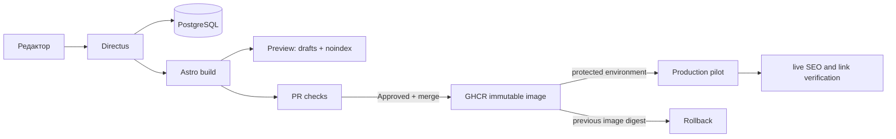

# План вертикального среза

## Граница этапа

Один ипотечный Hub, четыре контентные страницы на каждом из языков `pl` и `ru`, одна Service, один CTA, калькулятор как React island, внутренние ссылки, preview и автоматические release gates. Wix не меняется.

## Архитектурные решения

1. Directus и PostgreSQL — единственный источник контента; fixture используется только для тестов и автономной сборки.
2. Каждая локализация — отдельная строка `pages`; пары объединяет UUID `translation_group`.
3. Production публикует только `status=published`; preview добавляет `status=draft` и всегда возвращает `X-Robots-Tag/noindex` на уровне страницы/прокси.
4. Astro выполняет статическую сборку. Изменение Directus создаёт ChangeTask и инициирует новую preview/production-сборку, поэтому опубликованный артефакт неизменяем и откатывается по digest.
5. UI-компоненты едины: preview меняет только policy получения данных и SEO robots.
6. GitHub PR — граница изменения кода/схемы; редакторское изменение Directus версионируется в Directus и связывается с `change_tasks`.

## Последовательность

- Миграция схемы и seed.
- Directus REST adapter и типизированная модель.
- Общий Astro renderer, SEO и React island.
- Preview image с draft policy.
- PR gates, publish workflow, smoke verification и digest rollback.

Полный перенос Wix, knowledge graph, embeddings, CRM, dashboard, массовая генерация и автономная публикация исключены.
